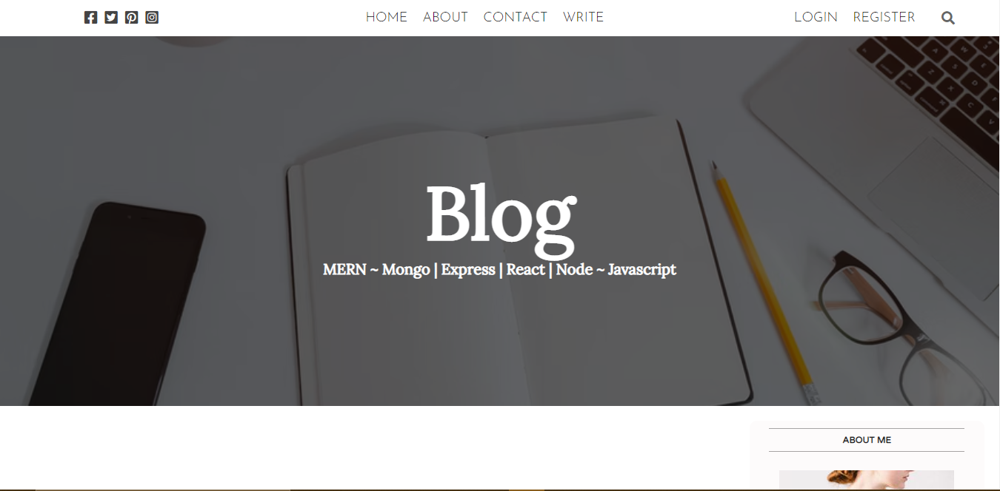

# MERN Blog Using React js, Node js, Express and Mongodb

## Looking for a demo? Searh no more

[Preview the demo here](https://supamernblog.techfortified.com)

## About this project

This is the implementation of a mern blog application react.js, nodejs, express js and mongodb. In this project, a user can be able to create new post as well as view all the blog posts on the site. If the user is not logged in, the user can easily create an account before creating new post. Authentication is done using JWT. The files are uploaded to express js server using multer and data is persisted in mongodb.

## Features 

Features include;

* Display blog posts
* JWT authentication 
* Create new post
* Update post
* Fetch & display single post details
* View posts based on logged in user

### How run this project

To run this project, **read the README.md** files in both *client* & *server* directories.

